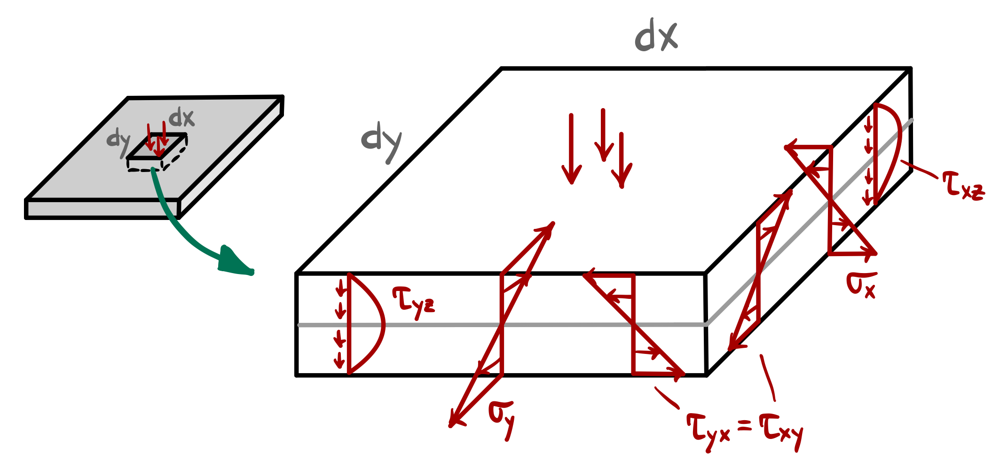
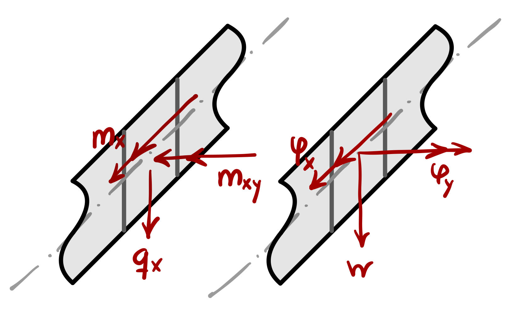
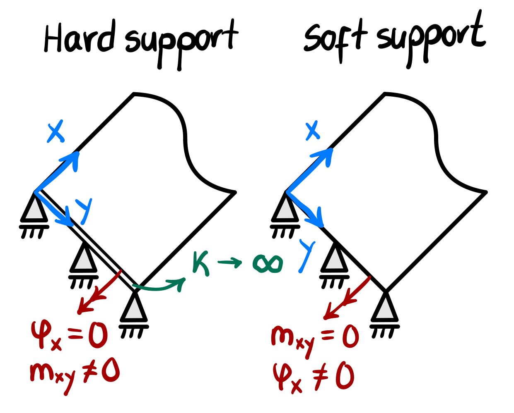

### Stress Resultants

To derive stress resultants, we replace the 3D stress state, which varies at every height $z$, with a single equivalent force or moment acting on the 2D mid-surface of the plate.

For the bending moments, we look at the torque they create relative to the neutral axis:

$$
m_{x} = \int_{-t/2}^{t/2} { \sigma_{x} z \, \text{d}z }, \quad
m_{y} = \int_{-t/2}^{t/2} { \sigma_{y} z \, \text{d}z }
$$
And the same is done for the twisting moments (or torsional moments):
$$
m_{xy} = \int_{-t/2}^{t/2} { \tau_{xy} z \, \text{d}z } 
$$
For the transverse shear resultants, we simply integrate the shear stresses across the thickness:
$$
q_x = \int_{-t/2}^{t/2} { \tau_{xz} \, \text{d}z }, \quad
q_y = \int_{-t/2}^{t/2} { \tau_{yz} \, \text{d}z }
$$
This allows us to solve the entire plate problem using only a 2D coordinate system.
## Equilibrium Equations

Gathering the stress resultants on an infinitesimal plate element yields the following equilibrium of forces equations:
$$\begin{aligned}
\sum{V} = 0 &\implies \frac{\partial{q_x}}{\partial x} + \frac{\partial{q_y}}{\partial y} = 0 \\
\sum{M_x} = 0 &\implies \frac{\partial m_y}{\partial y} + \frac{\partial m_{xy}}{\partial x} - q_y = 0 \\
\sum{M_y} = 0 &\implies \frac{\partial m_x}{\partial x} + \frac{\partial m_{yx}}{\partial y} - q_x = 0
\end{aligned}$$
## Kinematic Equations
$$\begin{aligned}
\kappa_{x} &= \frac{\partial \varphi_x}{\partial x} = -\frac{\partial^2 w}{\partial x^2}, \quad
\kappa_{xy} = \frac{\partial \varphi_x}{\partial y} = \frac{\partial \varphi_y}{\partial x} = -\frac{\partial^2 w}{\partial x \partial y} \\
\kappa_{y} &= \frac{\partial \varphi_y}{\partial y} = -\frac{\partial^2 w}{\partial y^2}
\end{aligned}$$
The kinematic link between the deformation of the mid-surface and the actual strains experiences by the material are described by:
$$\begin{aligned}
\varepsilon_x &= -z \kappa_x, \quad \gamma_{xy} = -z \kappa_{xy} \\
\varepsilon_y &= -z \kappa_y
\end{aligned}$$
## Constitutive Equations

### Bending and Twisting

The bending constitutive matrix, $\mathbf{D}_b$, describes how the material resists being curved, $\mathbf{m} = \mathbf{D}_b \boldsymbol{\kappa}$. In Kirchhoff-Love and Reissner-Mindlin theory, the internal moments are proportional to the curvature of the mid-surface.
$$\begin{Bmatrix} m_x \\ m_y \\ m_{xy} \end{Bmatrix} = 
D \begin{bmatrix} 1 & \nu & 0 \\ \nu & 1 & 0 \\ 0 & 0 & \frac{1-\nu}{2}\end{bmatrix} \begin{Bmatrix} \kappa_x \\ \kappa_y \\ 2\kappa_{xy} \end{Bmatrix}$$
### Transverse Shear

While classical Kirchhoff theory assumes the plate is infinitely rigid in shear, the more general Reissner-Mindlin theory acknowledges that the plate layers "slide" slightly against one another. The shear constitutive matrix, $\mathbf{D}_s$, defines this relationship $\mathbf{q} = \mathbf{D}_s \boldsymbol{\gamma}$:
$$
\begin{Bmatrix} q_x \\ q_y \end{Bmatrix} = \alpha G t \begin{bmatrix} 1 & 0 \\ 0 & 1 \end{bmatrix} \begin{Bmatrix} \gamma_x \\ \gamma_y \end{Bmatrix}
$$

## Partial Differential Equation

With 5 stress resultant unknowns ($m_{x}, m_{y}, m_{xy}, q_{x}, q_{y}$) and 3 equilibrium conditions ($\sum M_{x}, \sum M_{y}, \sum V$), the plate in bending is $5 - 3 = 2$ times static undeterminate, and therefore stress resultants cannot be computed without knowing the displacements. Analytical solutions are limited to some special cases (e.g. circular plates).

Combining the equilibrium, kinematic and constitutive equations gives us a fourth order differential equation
$$
\nabla^4{w} = \frac{p}{K}
$$

### Effective Shear Force

As a result of this 4th order differential equation, in the solution there exist four integration constants for each direction, i.e. two at each edge. However, at the edges there are three independent resultants or displacements defined, respectively.

As a result, we cannot impose all of these independently because the PDE only allows two independent conditions per edge. We can create a workaround **effective shear force**, accounting for the twisting moments:
$$
\bar{q}_x = q_{x} + \frac{\partial m_{xy}}{\partial y}
, \qquad
\bar{q}_{y} = q_{y} + \frac{\partial m_{yx}}{\partial x}
$$
The approximation takes effect only in a small layer near the boundary (boundary layer).

### Boundary Conditions

In Thin Plate Theory (Kirchhoff-Love), the 4th-order PDE requires exactly **two** conditions per boundary. These are selected based on the physical constraint of the edge:

| Type                |         |                   |                   |             |                                     |
| :------------------ | :-----: | :---------------: | :---------------: | :---------: | :---------------------------------: |
| Clamped             | $w = 0$ | $\varphi_{x} = 0$ | $\varphi_{y} = 0$ |     $-$     |                 $-$                 |
| Free edge           |   $-$   |        $-$        |        $-$        | $m_{x} = 0$ |       $m_{xy} = 0, q_{x} = 0$       |
| Simple soft support | $w = 0$ |        $-$        |        $-$        | $m_{x} = 0$ | $m_{xy} = 0, \, ^* \bar{q_x} = q_x$ |
| Simple hard support | $w = 0$ |        $-$        | $\varphi_{y} = 0$ | $m_{x} = 0$ |                 $-$                 |

## Load Carrying Behavior

### Twisting

Twisting moment is tightly coupled to shear forces and shear deformation. Its influence is strongest near edges and corners rather than in the interior.

**Note**: Both components $q_x$ and $\frac{\partial m_{xy}}{\partial y}$ cancel each other
**Note**: In plate, simple supports are referred to as Navier supports

### Soft and Hard Supports

Hard and soft supports refer to how we treat the tangential (in-plane) boundary conditions, specifically regarding the twisting moments and rotations.

- In **KT (thin plates)**, 
- In **R/M (thick plates)**, 

## Polar Coordinates

$$
\begin{Bmatrix} m_r \\ m_\varphi \end{Bmatrix} = D \begin{bmatrix} 1 & \nu \\ \nu & 1 \end{bmatrix} \begin{Bmatrix} -w'' \\ -\frac{1}{r}w' \end{Bmatrix}
$$

